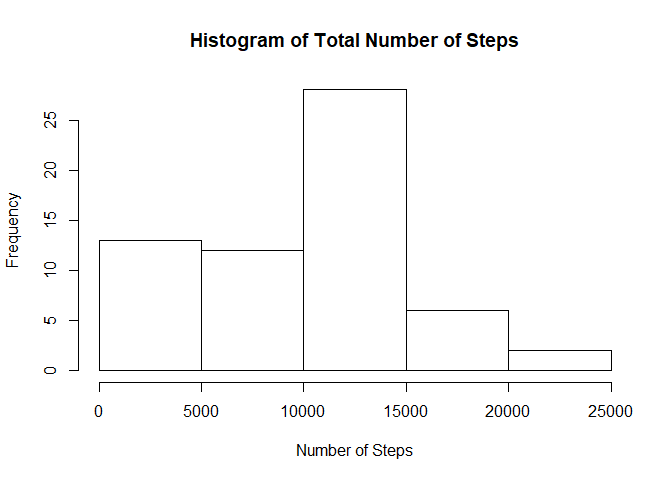
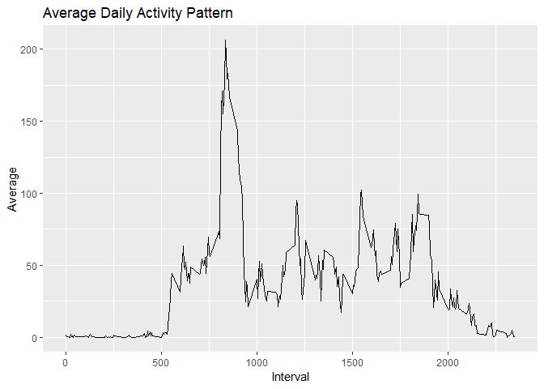
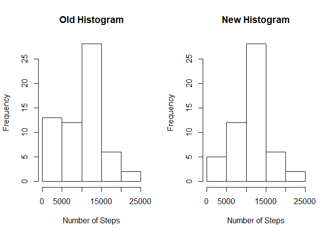
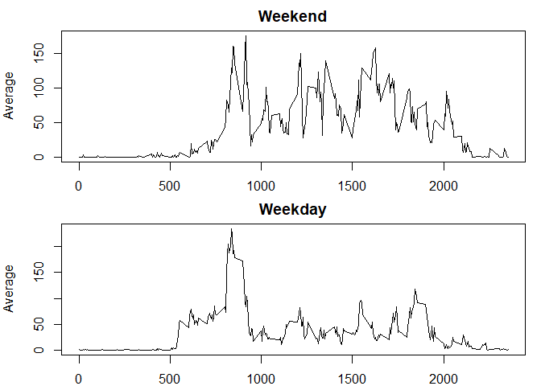

## Loading and Preprocessing the Data
First, set the working directory to the location of the data. Then, unzip the file to extract the csv document.
Convert the date variable to a date format.

```r
setwd("~/work/coursera/ReproducibleResearch")
unzip("repdata_data_activity.zip")
mydata <- read.csv("activity.csv")
mydata$date <- as.Date(mydata$date,format="%Y-%m-%d")
head(mydata)
```

```
##   steps       date interval
## 1    NA 2012-10-01        0
## 2    NA 2012-10-01        5
## 3    NA 2012-10-01       10
## 4    NA 2012-10-01       15
## 5    NA 2012-10-01       20
## 6    NA 2012-10-01       25
```


## What is mean total number of steps taken per day?
To show the distribution of the total number of steps taken per day, a histogram is plotted.

```r
agg <- tapply(mydata$steps,mydata$date,FUN=sum,na.rm=T)
hist(agg,main="Histogram of Total Number of Steps",xlab="Number of Steps")
```

<!-- -->

Next, we calculate the mean and median.

```r
meanval <- format(mean(agg,na.rm=TRUE),scientific=FALSE)
med <- format(median(agg,na.rm=TRUE),scientific=FALSE)
```
The mean of the total number of steps taken per day is 9354.23 while the median is 10395.


## What is the average daily activity pattern?
A plot of the average daily activity per interval is created to visualize a pattern.

```r
library(ggplot2)
avg <- aggregate(mydata$steps ~ mydata$interval, FUN=mean, na.rm=T)
names(avg) <- c("Interval","Average")
maxavgstep <- avg$Interval[max(avg$Average)]
ggplot(avg,aes(Interval,Average)) + geom_line() + labs(title="Average Daily Activity Pattern")
```

<!-- -->

This shows that, on average, the maximum number of steps occur in the 1705 minute interval.


## Imputing Missing Values
Missing values may produce misleading results. Therefore, NA values are replaced with the mean number of steps of that day.

```r
totalNA <- sum(is.na(mydata$steps))
newdata <- mydata
NAvals <- is.na(newdata$steps)
for(i in 1:length(NAvals)){
  if(NAvals[i]==T){
    getdate <- newdata$date[i]
    newdata$steps[i] <- mean(newdata$steps[newdata$date==getdate],na.rm=T)
  }
}
par(mfrow=c(1,2))
hist(agg,main="Old Histogram",xlab="Number of Steps")
newagg <- tapply(newdata$steps,newdata$date,sum)
hist(newagg,main="New Histogram",xlab="Number of Steps")
```

<!-- -->

```r
newmeanval <- format(mean(newagg,na.rm=TRUE),scientific=FALSE)
newmed <- format(median(newagg,na.rm=TRUE),scientific=FALSE)
```

Total number of missing values in the dataset is 2304.

The mean changed from 9354.23 to 10766.19.

The median changed from 10395 to 10765.

From the new histogram, it shows that the frequency of 0-5000 steps was reduced.


## Are there differences in activity patterns between weekdays and weekends?
A new variable is created to categorize each observation as "weekend" or "weekday". Two plots are then created to show the trend of the average steps per 5-minute interval.

```r
newdata$week <- weekdays(newdata$date,abbreviate=TRUE)
for(i in 1:nrow(newdata)){
  if(newdata$week[i]=="Sat"|newdata$week[i]=="Sun"){
    newdata$week[i] <- "weekend"}
  else{newdata$week[i] <- "weekday"}
}
wkends <- newdata[newdata$week=="weekend",]
wkendavg <- aggregate(wkends$steps ~ wkends$interval,FUN=mean,na.rm=T)
names(wkendavg) <- c("Interval","Average")

wkdays <- newdata[newdata$week=="weekday",]
wkdayavg <- aggregate(wkdays$steps ~ wkdays$interval,FUN=mean,na.rm=T)
names(wkdayavg) <- c("Interval","Average")

par(mfrow=c(2,1),mar=c(2,4,2,1))
with(wkendavg,plot(Interval,Average,type='l',main="Weekend"))
with(wkdayavg,plot(Interval,Average,type='l',main="Weekday"))
```

<!-- -->

The graphs show that there are generally lower number of steps, on average, during the weekdays compared to weekends.
